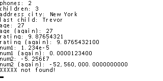

# S-json -- A Symbian C/C++ JSON Parser

===========================================================	

S-Json is a Symbian C/C++ Json Parser easy and simple to use.
Its code is released under the GNU GPLv3 (see COPYING FILE)

Release Version 1.1 includes:
	
	./COPYING			-- GNU GPLv3 License
	./readme.txt	-- this file
	
	./JsonParser/inc/ConsumeString.h
	./JsonParser/inc/JsonParser.h
	./JsonParser/src/ConsumeString.cpp
	./JsonParser/src/JsonParser.cpp
	
Changelog:
- 1.1 16 bit descriptor compatibility
- 1.0 Initial Release	

===========================================================	

Please refer to 
                   http://code.google.com/p/s-json/

for installation and usage instructions, troubleshooting and
everything else!

Or get in contact at LuisJavier.Chico [at] gmail [dot] com

Below are some coding and decoding examples for Symbian C++

```cpp
// json decoding example
void decode_string_example()
	{
	CJsonParser de = CJsonParser();	
	de.StartDecodingL(_L("[{\"Id\":197,\"interactions\":[{\"Id\":606,\"ticket\":\"1cb\"},{\"Id\":607,\"ticket\":\"0a782069196ec\"}],\"widgetAdDownloadUrl\":\"aaaa\"},{\"Id\":11197,\"interactions\":[{\"Id\":63406,\"ticket\":\"1cb\"},{\"Id\":602227,\"ticket\":\"0a782069196ec\"}],\"widgetAdDownloadUrl\":\"bbb\"}]"));
	TInt a = de.GetParameterCount(_L("[0]"));
	TInt b = de.GetParameterCount(_L("[1][interactions][1]"));

	
	CJsonParser ed = CJsonParser();
	ed.StartDecodingL(_L("{\"DOB\":\"\\/Date(928142400000+0200)\\/\",\"Id\":9223372036854775807,\"country\":\"String content\",\"created\":\"\\/Date(928142400000+0200)\\/\",\"gender\":\"String content\",\"lastAdUpdate\":\"\\/Date(928142400000+0200)\\/\",\"province\":\"String content\",\"tags\":[{\"Id\":2147483647,\"active\":true,\"name\":\"String content\",\"rootId\":2147483647}],\"userPreferences\":{\"active\":true,\"adtiming\":\"String content\",\"adtypes\":[{\"Id\":2147483647,\"active\":true,\"name\":\"String content\",\"rootId\":2147483647}]},\"username\":\"String content\"}"));

	TBuf<320> Id;
	int id = de.GetParameterValue(_L("[1][interactions][1][ticket]"),&Id);
	}
```

```cpp
// json encoding example
void encode_data_example()
	{
	CJsonParser de = CJsonParser();

	RBuf* jsonPost = new RBuf();
	de.StartEncoding(jsonPost);
		de.openObject();
			de.addParameter(_L("adPointsRedeemUrl"));de.addString(_L("String content"));de.addNext();
			de.addParameter(_L("latestAppVersion"));
			de.openObject();
				de.addParameter(_L("handset"));	de.addString(_L("String content"));de.addNext();
				de.addParameter(_L("version"));	de.addString(_L("String content"));de.addNext();
				de.addParameter(_L("downloadUrl"));de.addString(_L("String content"));de.addNext();
				de.addParameter(_L("required"));	de.addFixedValue(ETrue);
			de.closeObject();de.addNext();
			de.addParameter(_L("recommendFriendUrl"));de.addString(_L("String content"));
		de.closeObject();
	de.closeEncoding();	

	jsonPost->Close();
	delete (jsonPost);
	}
```

# Updated decoding example

JSON data (`jsonData` variable contents):

```json
{
	"first_name": "John",
	"last_name": "Smith",
	"is_alive": true,
	"age": 27,
	"address": {
		"street_address": "21 2nd Street",
		"city": "New York",
		"state": "NY",
		"postal_code": "10021-3100"
	},
	"phone_numbers": [
		{
			"type": "home",
			"number": "212 555-1234"
		},
		{
			"type": "office",
			"number": "646 555-4567"
		}
	],
	"children": [
		"Catherine",
		"Thomas",
		"Trevor"
	],
	"spouse": null,
	"rating": 9.87654321,
	"num1": 1.234e-5,
	"num2": -5.256E7
}
```

Code:

```cpp
	CJsonParser* parser = new (ELeave) CJsonParser;
	CleanupStack::PushL(parser);
	
	parser->StartDecodingL(jsonData);
	
	TInt count;
	
	count = parser->GetParameterCount(_L("[phone_numbers]"));
	console->Printf(_L("phones: %d\n"), count);
	
	count = parser->GetParameterCount(_L("[children]"));
	console->Printf(_L("children: %d\n"), count);
	
	TBuf<64> buf;
	TInt num;
	TReal numf;
	
	TBool res = parser->GetParameterValue(_L("[address][city]"), &buf);
	if (not res)
		User::Leave(KErrNotFound);
	console->Printf(_L("address city: %S\n"), &buf);
	
	res = parser->GetParameterValue(_L("[children][2]"), &buf);
	if (not res)
		User::Leave(KErrNotFound);
	console->Printf(_L("last child: %S\n"), &buf);
	
	res = parser->GetParameterValue(_L("[age]"), &buf);
	if (not res)
		User::Leave(KErrNotFound);
	console->Printf(_L("age: %S\n"), &buf);
	
	// the same as above
	parser->GetParameterValueL(_L("[age]"), num);
	console->Printf(_L("age (again): %d\n"), num);
	
	res = parser->GetParameterValue(_L("[rating]"), &buf);
	if (not res)
		User::Leave(KErrNotFound);
	console->Printf(_L("rating: %S\n"), &buf);
	
	// the same as above
	parser->GetParameterValueL(_L("[rating]"), numf);
	console->Printf(_L("rating (again): %.10f\n"), numf);
	
	res = parser->GetParameterValue(_L("[num1]"), &buf);
	if (not res)
		User::Leave(KErrNotFound);
	console->Printf(_L("num1: %S\n"), &buf);
	
	// the same as above
	parser->GetParameterValueL(_L("[num1]"), numf);
	console->Printf(_L("num1 (again): %.10f\n"), numf);
	
	res = parser->GetParameterValue(_L("[num2]"), &buf);
	if (not res)
		User::Leave(KErrNotFound);
	console->Printf(_L("num2: %S\n"), &buf);
	
	// the same as above
	parser->GetParameterValueL(_L("[num2]"), numf);
	console->Printf(_L("num2 (again): %.10f\n"), numf);
	
	res = parser->GetParameterValue(_L("[XXXXX]"), &buf);
	if (res)
		console->Printf(_L("XXXXX found\n"));
	else
		console->Printf(_L("XXXXX not found!\n"));
	
	
	CleanupStack::PopAndDestroy(parser);
```

Result:


